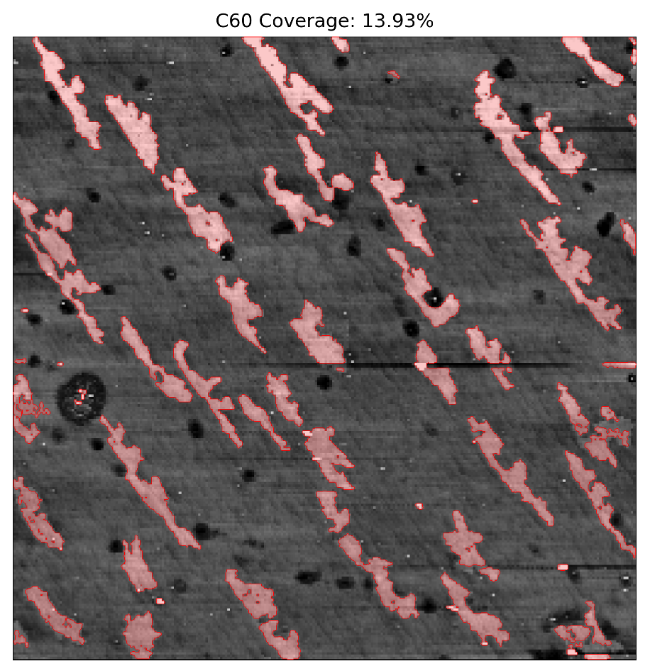

# STM Data Toolkit (minimal notebooks)

Small, self-contained notebooks for common STM/AFM post-processing tasks.  
Only a few example figures are shown; raw data and low-level details are intentionally omitted.

- **Focus:** topography detrending, dI/dV linecuts, simple coverage estimation (AFM edge detection).
- **Design goals:** tiny, reproducible, easy to skim; keep repository size small (notebooks saved with cleared outputs).

---

## Notebooks

**1) Edge detection for coverage (AFM / C60)**  
- View (nbviewer):  
  https://nbviewer.org/github/kl543/stm-toolkit/blob/main/notebooks/edge-detection.ipynb  
- Download (.ipynb):  
  https://raw.githubusercontent.com/kl543/stm-toolkit/main/notebooks/edge-detection.ipynb

**2) dI/dV linecut & topography path (K3C60)**  
- View (nbviewer):  
  https://nbviewer.org/github/kl543/stm-toolkit/blob/main/notebooks/linecut%20and%20topography.ipynb  
- Download (.ipynb):  
  https://raw.githubusercontent.com/kl543/stm-toolkit/main/notebooks/linecut%20and%20topography.ipynb

> Tip: If you rename the file to `linecut-topography.ipynb`, update the two links above accordingly.

---

## Selected Figures

  
  
  

---

## Repository Layout

